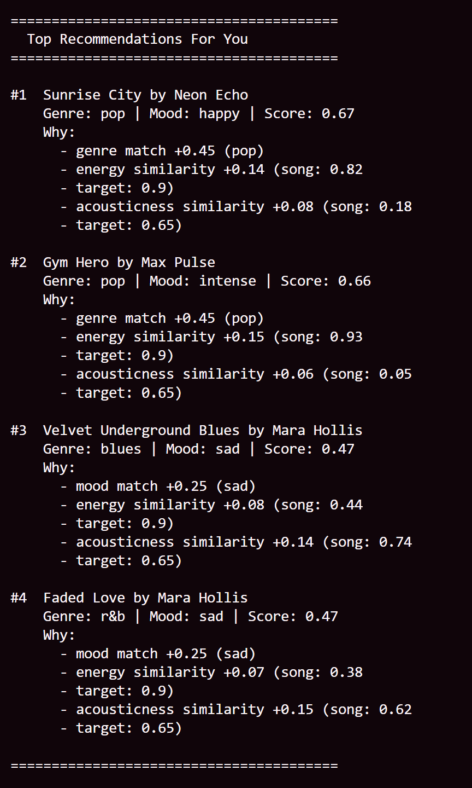
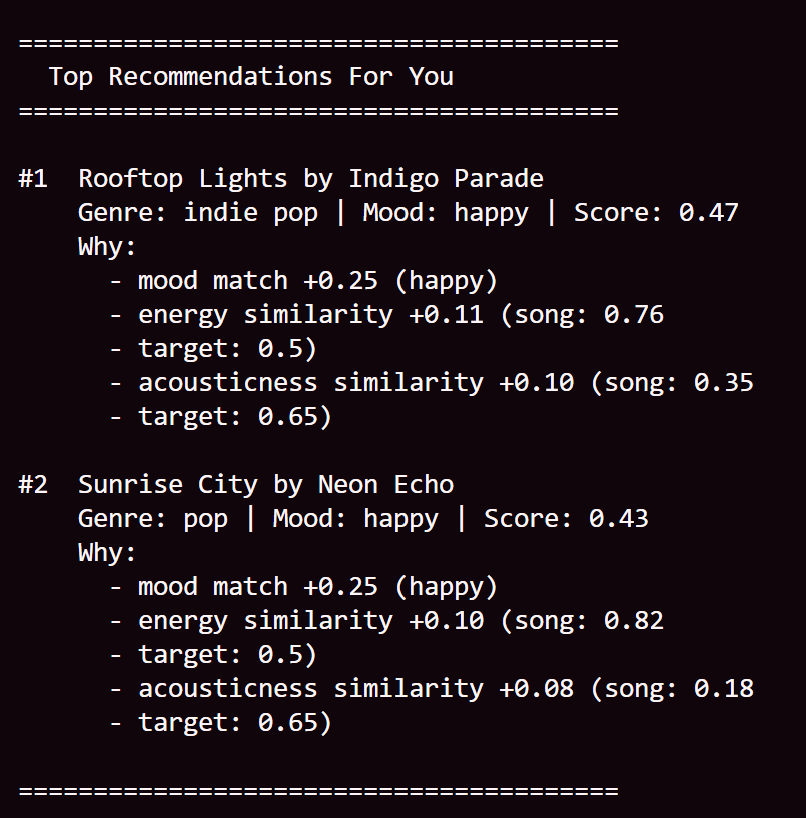
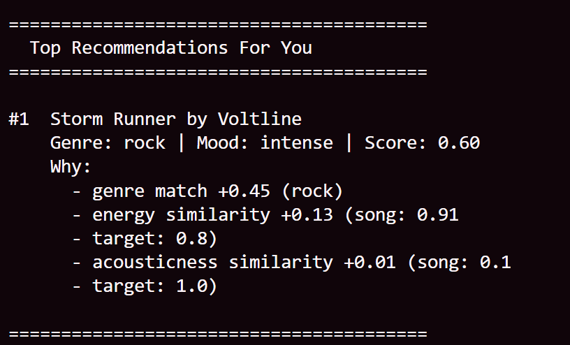
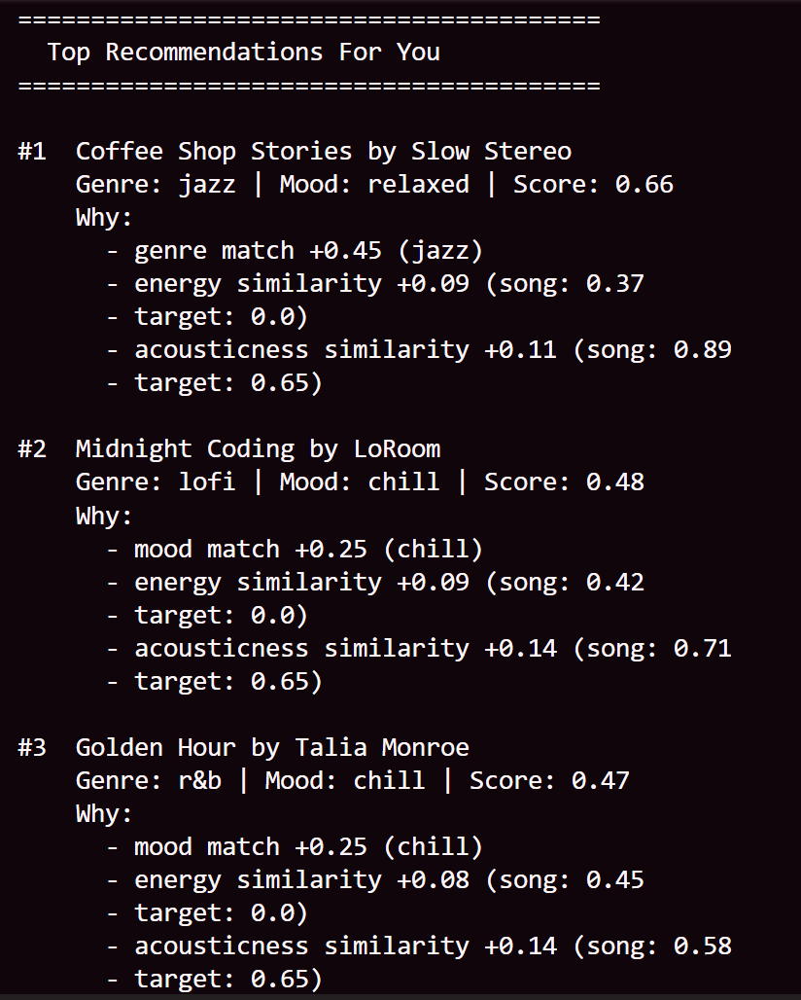

# 🎵 Music Recommender Simulation

## Project Summary

In this project you will build and explain a small music recommender system.

Your goal is to:

- Represent songs and a user "taste profile" as data
- Design a scoring rule that turns that data into recommendations
- Evaluate what your system gets right and wrong
- Reflect on how this mirrors real world AI recommenders

Replace this paragraph with your own summary of what your version does.

---

## How The System Works

Explain your design in plain language.

Some prompts to answer:

- What features does each `Song` use in your system

  Each Song stores genre (categorical), mood (categorical), energy (numeric, 0-1), and acousticness (numeric, 0-1). Energy measures how intense or driving a song feels. Acousticness measures how much the song relies on real instruments vs. electronic production.

- What information does your `UserProfile` store

  The UserProfile stores the user's preferred values for the same features: preferred genre, preferred mood, target energy (0-1), and target acousticness (0-1). For example: genre = "r&b", mood = "chill", target_energy = 0.45, target_acousticness = 0.65.

- How does your `Recommender` compute a score for each song

  The Recommender scores each song using four weighted components that add up to 1.0:

  - Genre match (45%): 1.0 if the song's genre matches the user's preferred genre, 0.0 if not
  - Mood match (25%): 1.0 if the song's mood matches the user's preferred mood, 0.0 if not
  - Energy similarity (15%): `1.0 - abs(song_energy - target_energy)` — closer to the user's target gets a higher score
  - Acousticness similarity (15%): `1.0 - abs(song_acousticness - target_acousticness)` — same idea

  Total score = (0.45 × genre_match) + (0.25 × mood_match) + (0.15 × energy_similarity) + (0.15 × acousticness_similarity)

- How do you choose which songs to recommend

  Songs are ranked by their total score in descending order. Only songs that score at least 40% (0.40) are included in the results. The top K songs from that filtered list are returned as recommendations.

You can include a simple diagram or bullet list if helpful.


---

## Getting Started

### Setup

1. Create a virtual environment (optional but recommended):

   ```bash
   python -m venv .venv
   source .venv/bin/activate      # Mac or Linux
   .venv\Scripts\activate         # Windows

2. Install dependencies

```bash
pip install -r requirements.txt
```

3. Run the app:

```bash
python -m src.main
```

### Running Tests

Run the starter tests with:

```bash
pytest
```

You can add more tests in `tests/test_recommender.py`.

---

## Experiments You Tried

Use this section to document the experiments you ran. For example:

- What happened when you changed the weight on genre from 2.0 to 0.5
- What happened when you added tempo or valence to the score
- How did your system behave for different types of users

---

## Limitations and Risks

- **Genre bias:** Genre carries 45% of the score, so a song that perfectly matches the user's mood, energy, and acousticness can still rank low if the genre label doesn't match exactly. A great R&B-adjacent song labeled "soul" or "jazz" would score as if it were completely wrong.
- **Only one R&B song in the catalog:** Since there is only one R&B song in the dataset, the genre weight almost always fires for the same song. The recommender doesn't have enough variety to actually explore within the user's preferred genre.
- **Exact string matching on mood:** Mood is binary — "chill" either matches or it doesn't. Similar moods like "relaxed" or "romantic" score zero, even though a real user might enjoy them equally.
- **Acousticness and energy may overlap:** Songs that are chill tend to also be acoustic, so these two features can reward the same songs twice rather than adding independent signal.
- **No user history:** The profile is fixed. The system has no way to learn from what the user actually plays or skips.

You will go deeper on this in your model card.

---

## Reflection

Read and complete `model_card.md`:

[**Model Card**](model_card.md)

Write 1 to 2 paragraphs here about what you learned:

- about how recommenders turn data into predictions
- about where bias or unfairness could show up in systems like this


---

## 7. `model_card_template.md`

Combines reflection and model card framing from the Module 3 guidance. :contentReference[oaicite:2]{index=2}  

```markdown
# 🎧 Model Card - Music Recommender Simulation

## 1. Model Name

Give your recommender a name, for example:

> VibeFinder 1.0

---

## 2. Intended Use

- What is this system trying to do
- Who is it for

Example:

> This model suggests 3 to 5 songs from a small catalog based on a user's preferred genre, mood, and energy level. It is for classroom exploration only, not for real users.

---

## 3. How It Works (Short Explanation)

Describe your scoring logic in plain language.

- What features of each song does it consider
- What information about the user does it use
- How does it turn those into a number

Try to avoid code in this section, treat it like an explanation to a non programmer.

---

## 4. Data

Describe your dataset.

- How many songs are in `data/songs.csv`
- Did you add or remove any songs
- What kinds of genres or moods are represented
- Whose taste does this data mostly reflect

---

## 5. Strengths

Where does your recommender work well

You can think about:
- Situations where the top results "felt right"
- Particular user profiles it served well
- Simplicity or transparency benefits

---

## 6. Limitations and Bias

Where does your recommender struggle

Some prompts:
- Does it ignore some genres or moods
- Does it treat all users as if they have the same taste shape
- Is it biased toward high energy or one genre by default
- How could this be unfair if used in a real product

---

## 7. Evaluation

How did you check your system

Examples:
- You tried multiple user profiles and wrote down whether the results matched your expectations
- You compared your simulation to what a real app like Spotify or YouTube tends to recommend
- You wrote tests for your scoring logic

You do not need a numeric metric, but if you used one, explain what it measures.

---

## 8. Future Work

If you had more time, how would you improve this recommender

Examples:

- Add support for multiple users and "group vibe" recommendations
- Balance diversity of songs instead of always picking the closest match
- Use more features, like tempo ranges or lyric themes

---

## 9. Personal Reflection

A few sentences about what you learned:

- What surprised you about how your system behaved
- How did building this change how you think about real music recommenders
- Where do you think human judgment still matters, even if the model seems "smart"


    # UserProfile(favorite_genre="pop", favorite_mood="sad", target_energy=0.9, likes_acoustic=False)


    # UserProfile(favorite_genre="bossa nova", favorite_mood="happy", target_energy=0.5, likes_acoustic=True)


    # UserProfile(favorite_genre="rock", favorite_mood="angry", target_energy=0.8, likes_acoustic=True)


    # UserProfile(favorite_genre="jazz", favorite_mood="chill", target_energy=0.0, likes_acoustic=True)

    

  